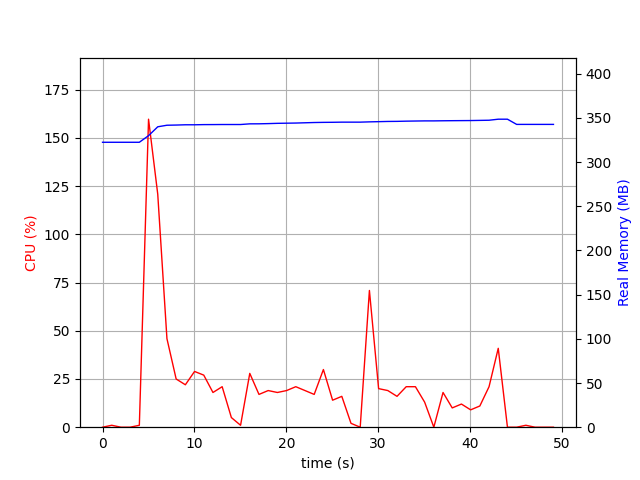
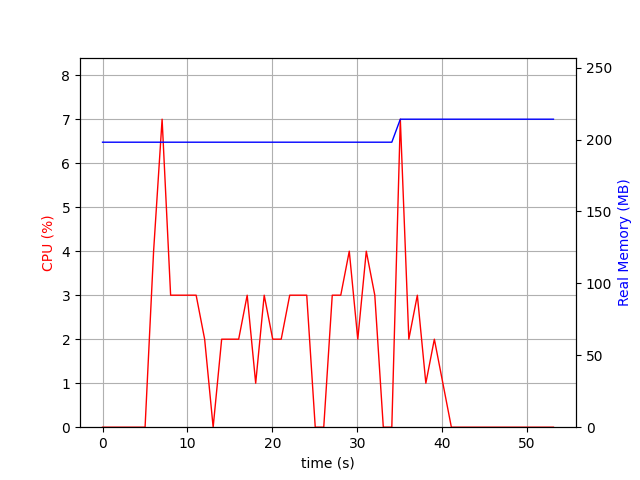

# Java Optimised

Java Optimised is a project focused on enhancing Java/Spring Boot workflows and deployments by improving build times, reducing image sizes, and lowering memory and CPU usage. It demonstrates optimisation techniques across build workflows, deployments, and runtime performance, using a basic User Service application—a CRUD API built with Spring Boot and Spring Data JPA—as a test service for evaluating these strategies.


[todo- add a list of other areas to optomise- these are low hanging fruit]  
[dissad nativeimage]

---

## Table of Contents
- [Java Optimised](#java-optimised)
- [Optimisation Areas](#optimisation-areas)
  - [1. Build Workflow Optimisations](#1-build-workflow-optimisations)
    - [Multi-Stage Builds](#multi-stage-builds)
    - [Gradle & Docker Caching](#gradle--docker-caching)
  - [2. Runtime Performance Optimisations](#2-runtime-performance-optimisations)
    - [Lightweight Runtime Image](#lightweight-runtime-image)
    - [GraalVM Native Image](#graalvm-native-image)
- [Potential Cost Savings](#-potential-cost-savings)
---

## Optimisation Areas

The project focuses on two primary areas of optimisation:

1. **Build Workflow Optimisations**
2. **Runtime Performance Optimisations**

Each optimisation technique is explored in detail, with links to corresponding branches where the implementations can be found.

---

## 1. Build Workflow Optimisations

Efficient build workflows reduce development cycle times and improve deployment efficiency. The following optimisations target build processes:

### Multi-Stage Builds ([`user-service example`](https://github.com/mm-camelcase/user-service/blob/optomised-v1/Dockerfile))

**Description:** Multi-stage builds split the build and runtime environments into separate Docker layers, reducing the final image size and simplifying deployment processes. By using multi-stage builds, you can exclude unnecessary tools from the final image and reduce security risks.  

Example Dockerfile snippet:
```dockerfile
# Stage 1: Build
FROM maven:3.9.5-eclipse-temurin-17 as builder
WORKDIR /app
COPY . .
RUN mvn clean package -DskipTests

# Stage 2: Runtime
FROM amazoncorretto:17-alpine
WORKDIR /app
COPY --from=builder /app/target/*.jar app.jar
ENTRYPOINT ["java", "-jar", "app.jar"]
```

**Key Benefits:**

- Smaller image size (see size comparisons between [Single-Stage Builds](#table-1-single-stage-builds-jdk-included) and [Multi-Stage Builds](#table-2-multi-stage-builds-jdk-for-build-stage-jre-for-runtime) below )
- Reduced build times
- Improved security by minimising the attack surface
- Simpler CI/CD Pipelines

---

### Gradle & Docker Caching ([`user-service example`](https://github.com/mm-camelcase/user-service/blob/optomised-v3/Dockerfile))

**Description:** This technique leverages caching mechanisms for Gradle and Docker layers to avoid redundant build steps and speed up subsequent builds. Caching is essential for large projects, where rebuilding the same layers repeatedly can waste time and resources.

**Key Benefits:**

- Faster build times by avoiding redundant steps
- Reduced network usage during builds
- Optimised CI/CD pipelines for faster deployments

Example Gradle Cache Workflow:
```yml
...
      # Cache Gradle dependencies
      - name: Cache Gradle
        uses: actions/cache@v4
        with:
          path: |
            ~/.gradle/caches
            ~/.gradle/wrapper
          key: gradle-${{ hashFiles('**/*.gradle*', '**/gradle-wrapper.properties') }}
          restore-keys: |
            gradle-${{ runner.os }}-
            gradle-
...
```

Example Docker Layer Cache Workflow:
```yml
...
      # Cache Docker layers
      - name: Cache Docker layers
        uses: actions/cache@v4
        with:
          path: /tmp/.buildx-cache
          key: docker-cache-${{ github.ref_name }}-${{ hashFiles('Dockerfile') }}
          restore-keys: |
            docker-cache-${{ github.ref_name }}-
            docker-cache-
...
```

**Results:**

Caching significantly reduced the build and push time for a Java source code change (with no modifications to Gradle dependencies or the Dockerfile).

| Metric          | `no caching` | `caching enabled` |
|-----------------|-----------------|----------------|
| Build Time      | 57 s           | 4s          |
| Push Time       | 28 s            | 2s          |

---

## 2. Runtime Performance Optimisations

Optimising runtime performance can significantly improve application scalability and reduce operational costs. The following techniques focus on runtime improvements:

### Lightweight Runtime Image ([`user-service example`](https://github.com/mm-camelcase/user-service/blob/optomised-v2/Dockerfile#L21))

**Description:** Using lightweight base images, such as Alpine or Distroless, reduces the final image size and enhances security by limiting the number of installed packages. This can improve application performance and reduce cloud infrastructure costs.

**Key Benefits:**

- Smaller image sizes
- Enhanced security
- Reduced resource consumption

Here are commonly used Java 17 base images for various requirements. Image sizes vary significantly, affecting resource usage and costs, so choosing an optimised image can help lower cloud expenses.

##### Table 1: Single-Stage Builds (JDK Included)

| **Image**                          | **Base OS**      | **Size**   | **Use Case**                    | **Pros**                                            | **Cons**                              |
|------------------------------------|------------------|------------|---------------------------------|----------------------------------------------------|---------------------------------------|
| `eclipse-temurin:17-jdk`           | Debian/Ubuntu    | ~300 MB    | General purpose                 | Well-maintained, widely used, secure               | Larger image size                     |
| `amazoncorretto:17`                | Amazon Linux 2   | ~200 MB    | AWS deployments                 | Optimised for AWS, long-term support by Amazon     | Tied to AWS ecosystem                 |
| `openjdk:17-jdk`                   | Debian/Ubuntu    | ~300 MB    | General purpose                 | Official OpenJDK build, widely compatible          | Larger size compared to other JDKs    |
| `eclipse-temurin:17-jdk-alpine`    | Alpine Linux     | ~80 MB     | Minimal image size              | Very small image, suitable for lightweight apps    | Potential compatibility issues        |
| `ghcr.io/graalvm/graalvm-ce:java17`| Oracle Linux     | ~350 MB    | Native builds and performance   | Supports native compilation with `native-image`    | Larger size and complex native builds |

##### Table 2: Multi-Stage Builds (JDK for Build Stage, JRE for Runtime)

| **Runtime Image**                  | **Base OS**      | **Size**   | **Use Case**                    | **Pros**                                            | **Cons**                              |
|------------------------------------|------------------|------------|---------------------------------|----------------------------------------------------|---------------------------------------|
| `eclipse-temurin:17-jre`           | Debian/Ubuntu    | ~70 MB     | General purpose runtime         | Well-maintained, widely used, secure               | Slightly larger than Alpine-based JRE |
| `amazoncorretto:17-al2-jre`        | Amazon Linux 2   | ~40 MB     | AWS deployments                 | Optimised for AWS, secure                          | AWS-specific                          |
| `eclipse-temurin:17-jre-alpine`    | Alpine Linux     | ~30 MB     | Minimal image size              | Very small, suitable for lightweight apps          | Potential glibc compatibility issues  |
| `cgr.dev/chainguard/jre:17`        | Distroless       | ~50 MB     | Security-focused runtime        | Minimal attack surface, no shell                  | Limited debugging options             |
| `gcr.io/distroless/java17-debian11`| Distroless       | ~50 MB     | Secure production deployments   | Reduced attack surface, no package manager         | No shell or package manager           |
| `ghcr.io/graalvm/graalvm-ce:java17`| Oracle Linux     | ~80 MB     | Native builds                   | Use `native-image` to produce a native executable  | Native builds require more setup      |

---

### GraalVM Native Image ([`user-service example`](https://github.com/mm-camelcase/user-service/blob/optomised-v4/Dockerfile#L15))

**Description:** GraalVM enables Java applications to be compiled into native executables, resulting in faster startup times and lower memory usage. This is particularly beneficial for serverless environments and microservices where cold start times are critical.

**Key Benefits:**

- Faster startup times
- Reduced resource usage
- Faster startup times.
- Optimised for microservices and serverless functions

**Results:**

Since JVM metrics are not available with native builds, the statistics were gathered using docker stats combined with the [psrecord tool](tools/psrecord/README.md). A simple [load test](scripts/load-test.sh) was used to measure CPU and memory consumption during the test. The graphs below show the comparison between the standard JVM and GraalVM Native Image.   
  

|  |  |
|--------------------------------------|------------------------------------------|
| **Standard Image**                          | **Native Image**                            |

  
  
This table highlights the differences between Standard JVM and GraalVM Native Image builds.
  


| Metric                  | Standard JVM     | GraalVM Native Image |
|-------------------------|------------------|----------------------|
| Max CPU Usage (%)       | 159.7            | 7.0                  |
| Average CPU Usage (%)   | 19.63            | 1.58                 |
| Max Real Memory (MB)    | 348.42           | 214.16               |
| Average Real Memory (MB)| 341.92           | 203.98               |
| Max Virtual Memory (MB) | 8924.07          | 1704.35              |
| Average Virtual Memory (MB) | 8916.54       | 1695.44              |
| Startup Time (s)        | 12.24            | 0.067                |

**Key Takeaway:**

The comparison highlights a **dramatic reduction in resource usage** when switching from **Standard JVM** to **GraalVM Native Image**:

- 🔥 **CPU Usage:**  
  Max CPU drops from **159.7%** to just **7%**, with an average reduction of nearly **90%**.

- 💾 **Memory Consumption:**  
  - **Real Memory** reduced by over **35%**.  
  - **Virtual Memory** drops from **~8.9 GB** to **~1.7 GB**, a reduction of more than **80%**.

- ⚡ **Startup Time:**  
  Startup time improves **drastically** from **12.24 seconds** to just **0.067 seconds**, making GraalVM ideal for **serverless** and **microservices**.

## 💰 Potential Cost Savings

These improvements can lead to:
- **Lower cloud infrastructure costs** due to reduced CPU and memory usage.
- **Improved scalability** with faster startup times, reducing cold start penalties in **pay-per-use serverless models**.
- **Better user experience** with faster response times.

Switching to **GraalVM Native Image** can be a **game-changer** for **high-traffic microservices** or **serverless applications**, offering both **performance gains** and **significant cost savings** at scale.

### Realistic Example of ECS Cost Savings
For a typical **AWS ECS task**, a Java application using a **Standard JVM** may require **2 vCPU** and **4 GB memory** to handle a given workload. By optimising with **GraalVM Native Image**, the same application can run efficiently with **0.5 vCPU** and **1 GB memory**.

| **Configuration**        | **Standard JVM**       | **GraalVM Native Image** |
|--------------------------|------------------------|--------------------------|
| vCPU                     | 2                      | 0.5                      |
| Memory (GB)              | 4                      | 1                        |
| Estimated Cost/Month     | ~$100/month            | ~$25/month               |
| **Total Cost (50 Tasks)** | ~$5,000/month          | ~$1,250/month            |

Assuming a fleet of **50 ECS tasks**, switching to GraalVM could result in **monthly savings of ~$3,750**, or **~$45,000 annually**.
